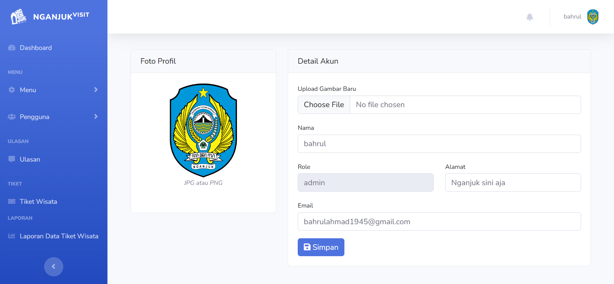
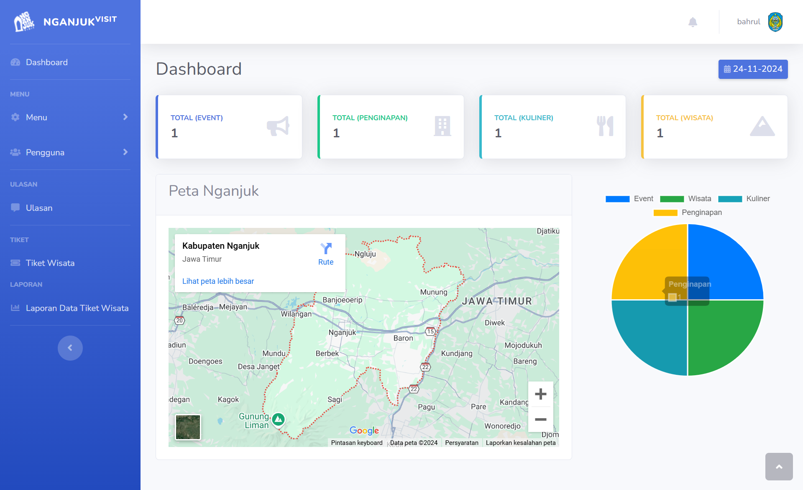

# NGANJUK VISIT 🌏

Your gateway to exploring the beauty and culture of Nganjuk!

Nganjuk Visit is a comprehensive platform that provides information on tourism, culinary delights, hotels, and events in Nganjuk. With a user-friendly design and rich features, discovering the wonders of Nganjuk has never been easier!

---






---

## 🛠 Technology


---

## 🎯 Features

- 🌍 Tourism Info: Discover the best tourist destinations in Nganjuk.
- 🍽️ Local Cuisine: Explore Nganjuk's unique dishes.
- 🏨 Accommodation: Choose the best hotels for your comfort.
- 🎉 Local Events: Stay updated with the latest events and festivals.
- 🔍 Live Search: Quickly search data using the live search feature.
- 📊 Data Management: Full CRUD (Create, Read, Update, Delete) for admins.

---

## 🚀 Getting Started

Follow these steps to set up the project locally:

### Prerequisites

- **PHP**: Version `8.3.8` or higher
- **XAMPP**: Version `3.3.0` or higher

### Installation

1. Install **PHP** and **XAMPP**.
2. Start **Apache** and **phpMyAdmin** from XAMPP.
3. Create a database in **phpMyAdmin**.
4. Import the provided `nganjukvisit.sql` into the database.

---

## 🔧 Clone the Repository

Clone this project to your local machine using your preferred method:

**HTTPS**

```bash
git clone https://github.com/hajuenter/web_nganjukvisit.git

```

**SSH**

```bash
git clone git@github.com:hajuenter/web_nganjukvisit.git
```

**GitHub CLI**

```bash
gh repo clone hajuenter/web_nganjukvisit
```

---

## 🛠 Tech Stack

- Frontend: PHP, JavaScript, jQuery, Bootstrap
- Backend: MySQL (Database)
- Tools: XAMPP, Git

---

## 📊 Running Tests

Follow these steps to perform testing:

Make sure the local server is running (XAMPP).
Check all the features through the browser, including:

- Live search.
- CRUD data.
- Display of tourism, culinary, accommodation and events.

---

## 📧 Contact

If you have any questions or feedback, feel free to reach out:

- Email: bahrulahmad1945@gmail.com
